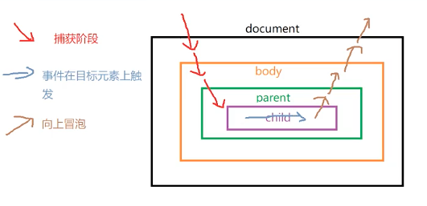

## React核心内容

react的版本，16.8是个分界点，前面是核心功能，后面是优化为主

### 1.特点
- 虚拟dom
- 声明式编程
- jsx
- 组件化
- 单项数据流
- 生态丰富健全

### 2.虚拟DOM
1.what？why?
因为直接操作DOM的代价是很高的，可能会引起浏览器的重排重绘
虚拟DOM其实是一个真实DOM的轻量级表示，本质是一个js对象，映射为真实DOM的结构和属性
虚拟dom的目的是最小化真实DOM的操作次数，提高性能

```json
{
    "type":"div",
    "props": {
        "style": {
            "color": "red"     
        },
        "classname": "container",
        "children": [
            "hello",
            {
                "type":"span",
                "props": {
                    "style": {
                        "color": "blue"
                    },
                    "children": "world"
                }
            }
        ]
    }
}
```

2.工作机制
- 当初次渲染的时候，会创建一个描述UI的虚拟DOM，然后由React负责把它变成真实DOM并且渲染到页面
- 当某个部分发生变化，React会创建一个新的虚拟DOM并与老的虚拟DOM对比，找出二者差异，就是所谓的dom diff
- 找到后确定应该如何最小化的修改真实DOM，反应UI变化，最后把真实DOM映射到页面中
  
3.优势
- 性能提升，批量修改真实DOM,且只会进行最小化的更新，修改必要的部分，避免昂贵的DOM操作和不必要的浏览器重排重绘
- 简化代码，不需要关心如何操作DOM，只需要声明UI和操作
- 跨平台，由于虚拟DOM实际是js对象，可以在不同环境复用，ReactNative、React360(VR)

4.渲染到界面
import ReactDOM from "react-dom/client"

react-dom/client是因为还有ssr的模式，这边是web客户端所以client

createRoot得到了容器节点，并且附带了render的方法，将虚拟dom映射成真实dom

### 3.为什么使用JSX

- **声明式的语法**：jsx提供了一种看起来很像html的语法，能够直观的描述UI和结构，这样代码更易读更易于维护
- **组件化**：通过jsx，可以定义组件，易于复用、测试、关注点的分离
- **整合能力**：由于jsx本质还是js，所以我们可以在其中插入任意有效的js表达式，还可以把js当做函数的参数或者返回值，为UI组件的创建提供灵活性

```js
// element1和element2是一样，一个是手写虚拟dom的结构，一个是jsx
const element1 = React.createElemenet({type:'div',props:{...}});
const element2 = (<div>....</div>)
root.render(element2);
```
除了jsx外还有别的方案么？

1. 纯js，就是最上面的虚拟dom的结构对象，太复杂不易开发
2. 模版语言，比如vue Angular，要学习指令（*ngFor v-if），且无法用完整的js功能
3. 字符串拼接，最大的问题是不安全，容易收到xss（跨站脚本攻击），而jsx会自动进行安全转译,比如写了一个死循环的js在jsx中，编译后会发现直接变成了字符串，不会真的执行
```js
//字符串拼接指的是这种：
let data = [1,2,3];
let html = '';
data.forEach((v)=>{
    html+=`<li>${v}</li>`
})
cotainer.innerHTML=html;
```

### 4.类组件和函数组件的区别

相同点：
- 功能都是渲染ui
- 都可以接受属性并返回虚拟dom，进行渲染
- 本质来说它们的表现是一样的

不同：
- 类组件基于面向对象编程思想，使用es6语法，要掌握this的使用
- 函数组件是基于函数式编程，更简单，没有this

### 5.React中的合成事件

合成事件（SyntheticEvent），是为了解决跨浏览器事件一致性设计的，它是浏览器原生事件的跨浏览器包装器，具有和原生相同的接口，但功能更完整且保持浏览器一致性

<b>浏览器中的事件模型的一些概念：</b>

- 事件流：描述了页面中接收事件的顺序，捕获和冒泡（捕获的阶段，只会到target的外层的）
- 事件监听器： 可以使用js在dom元素上添加事件监听器来响应特定的事件
- 事件对象：监听器会收到事件对象event
- 取消默认行为 event.preventDefault()
- 停止事件传播 event.stopPropagation()

<b>为什么用合成事件：</b>
- 跨浏览器一致性
- 提高性能，根据浏览器冒泡的特性，可以在父元素监听子元素的事件，不需要绑在每个子元素上，只要在根节点绑一次就可以。其实是用了事件委托/事件代理

<b>版本差异</b>
- react17之前，合成事件是委托给文档对象document
- 17之后，委托给了root，也就是`<div id="root"></div>`这个根节点
- 这样设计的原因是防止一个页面有两套react的时候，document只有一个

<b>顺序</b>
如果同时在节点上绑定原生的监听，那和事件代理的执行顺序是怎样的？

捕获阶段：事件代理比原生监听早触发
冒泡阶段：原生比事件代理早触发

因为代理在root上，行为进来先到root，出去最晚到root

