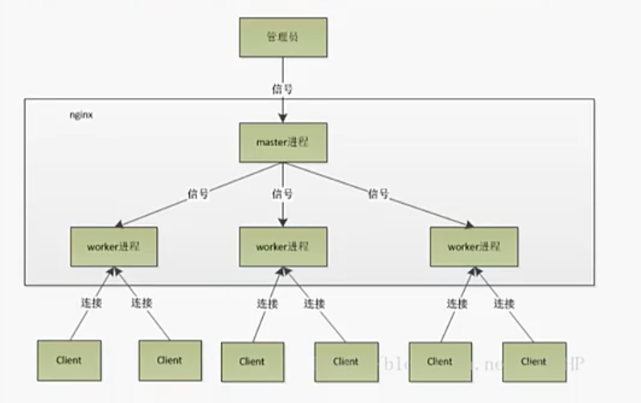

## Nginx - 介绍、特点、理论

web服务器

### 1.nginx应用场景

- 静态资源服务器
- 反向代理服务
- API接口服务

API接口服务：

可以做权限控制、做缓存，比如自己公司的后端服务，只希望自己的产品调用，不能公开调用，可以在nginx直接拦截掉

如果到后端服务的层面再判断端是不是自己的应用然后拦截就很浪费时间，client->nginx->server->nginx-client这样的请求流转没有必要。

例：Lua是nginx编程的工具，可以在nginx中添加权限的判断，加一个数据库（可以用Memcached），是个类似redis的key value数据库

### 2.优势

- 高并发高性能

nginx性能特别高，1核1G的最便宜的服务器，做静态资源时，抗几万十几万并发都没问题

- 可扩展性好

微内核，源码大小很小，核心功能不多，别的功能是模块的形式实现的，可以动态的添加和减少模块，也方便自己二次开发，自己写新的功能

- 高可靠性

- 热部署

更新时不用关机重启，直接覆盖就可以平滑升级。 机制：覆盖后原来的是 .old，旧请求还会再.old处理，新进来的请求会在新的服务中处理，直到old的请求全部处理完成，就把old删除

- 开源

### 3.nginx架构

为什么会有这么强的性能，需要了解它的架构

#### 3.1 轻量

源代码只包含核心模块，其它功能都是模块的形式实现的，可自由选择

#### 3.2 架构

nginx采用的是多进程（单线程，每个进程有一个线程）和多路IO复用模型

进程是分配资源最小单位，一个进程可能有一个或多个线程，相当于一个厂房，线程是厂房里的工人

3.2.1 工作流程

1. nginx在启动后，会有一个master进程和多个独立的worker进程
2. 接收外界的信号，向各worker进程发送（分配）信号
3. master进程能监控worker的运行状态，当worker进程退出后（异常情况下），会自动启动新的worder进程

这边的worker的数量，一般是看cpu有几核来设置的，4核就4个worker，过多的worker只会竞争cpu，带来不必要的上下文切换

使用多进程的模式，不仅可以提高并发率，而且进程之间相互独立，一个worker挂了也不会影响到别人

3.2.2 IO多路复用

一些相关前提知识点：

- 用户空间和内核空间：

比如一个32位的系统，4G内存，1G是内核空间，3G是用户空间，隔离是为了安全，内核信息敏感所以用户层面无法访问，只供系统访问和操作

- 进程间上下文切换：

进程间的切换影响性能，因为每个进程做的事情有自己的上下文，如果换一个事情做的话，前面没做完的进行的上下文需要被暂存下来，然后切回来的时候 需要恢复

- 文件描述符（File descriptor）

访问文件的时候，请求之后会返回一个索引号就是文件描述符，会通过索引来操作文件

从3开始打头，因为012已经用掉了，0是标准输入，1是标准输出，2是错误输出

- IO模式：

如果我们要读取一个文件，首先是用户空间中有一个进程，比如 是node，它要请求读取文件，用户空间是不能直接读的，需要请求内核空间帮忙读取， 内核读取到内核的缓冲区，后再拷贝到应用程序的缓冲区，最后交给进程。

正因为有这2步骤的存在，所以才有同步、异步，阻塞、非阻塞这些概念。

同步、异步->用户空间向内核空间发送的请求，是同步还是异步。

阻塞、非阻塞-> 是等待内核操作完成还是不等待

4个可以组合成各种情况：

- 同步阻塞IO
- 同步非阻塞IO
- 异步阻塞IO（IO多路复用）
- 异步非阻塞IO

性能最差的是同步+阻塞，Apache就是这样的。 但也没有哪种是最好的，只能说某个场景下，哪种最合适。

比如假设处理的时间极短，那同步阻塞有可能是最快的，直接拿到直接给。异步非阻塞很灵活，但是各种通知有可能会增加开销，最终导致性能并不高。

- Nginx是第三种

第三中加上IO多路复用。就是说多个顾客可以给一个服务员（因为单线程）下单，然后这个服务员又对多个厨师，事件模型是epoll的模式，回调的形式通知。

事件模型除了epoll，还有select和poll，这两个都是轮询的形式（能记录多少个厨师的差别，select在32位系统是1024个），这个的选择是可以自定义的

后端处理特别快的话适合select，每次轮询都不会落空，没那么快的话时候epoll（一般就用回调了

nginx的工作原理和node几乎一样

更详细的文章：https://zhuanlan.zhihu.com/p/367591714?utm_medium=social&utm_oi=57954145402880&utm_id=0

所以现在大部分都是一核一进程一线程的形式，多个线程反而要一直切换上下文造成卡顿

3.2.3 CPU亲和

把CPU内核和nginx的工作进程绑定在一起，让每个worker进程固定在一个CPU上执行，减少cpu切换并提高缓存命中率，提高性能

3.2.4 sendfile 零拷贝传输模式

上面提到操作、读取文件是分两个步骤的，用户空间和内核空间。静态文件的请求直接从内核进入直接读出来，不用去用户空间走一圈。 动静分离，静态比如html css js直接读，动态内容才需要应用程序处理。所以性能好。

