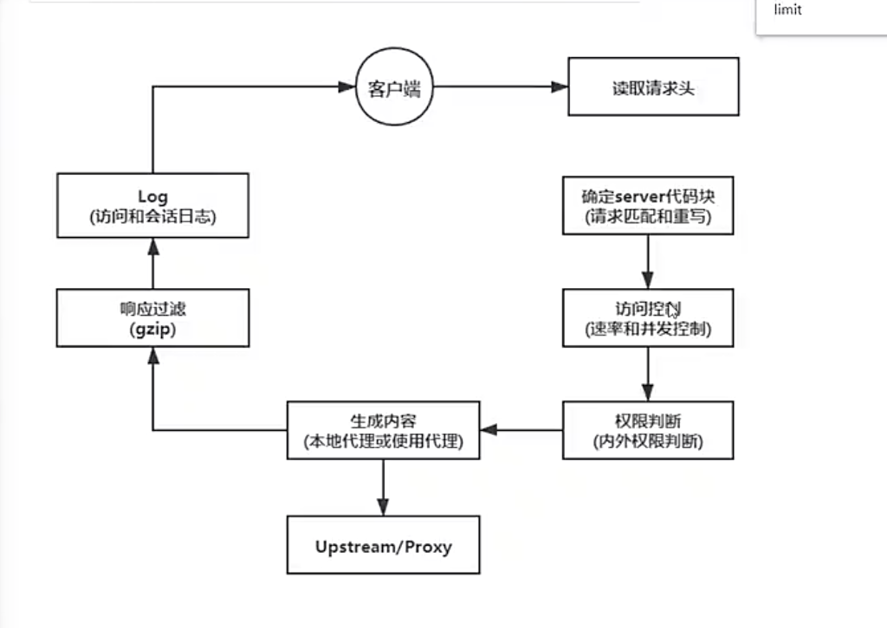

## Nginx - 整体配置 命令

### 1 总体配置

查看安装版本: nginx -v

查看编译时的参数: nginx -V

查看安装的配置文件和目录: rpm -ql nginx

检查配置文件语法是否正确：nginx -t （在reload配置的时候 最好先做校验）

#### 1.1 日志切割文件

/etc/logrotate.d/nginx 查看

配置成daily就可以每天输出一个日志，使得单个日志文件没有那么庞大

ls /var/log/nginx/*.log 文件的位置

#### 1.2 主配置文件

核心配置文件： /etc/nginx/nginx.conf

默认http服务器配置文件： /etc/nginx/conf.d/default.conf

主配置文件中有 include /etc/nginx/conf.d/*.conf,可以避免主文件太大，不同的模块或者需求可以配单独的conf，会被include进来

一些别的配置文件：

转换编码的文件（因为nginx作者是俄国人）：/etc/nginx/koi-utf koi-win win-utf

扩展名文件：/etc/nginx/mime.types

#### 1.3 守护进程管理

用户配置系统守护进程管理器管理方式

```
systemctl start nginx.service
systemctl stop nginx.service
systemctl restart nginx.service 重启（正在进行的连接会断开）
systemctl reload nginx.service 重新加载配置文件（不会中断服务）

相当于centos6的 service start nginx）
```

#### 1.4 nginx目录

1. nginx安装的模块，最基本的共享库和内核模块 /etc/nginx/modules
2. 缓存目录 /var/cache/nginx
3. 日志 /var/log/nginx
4. 可执行命令 /usr/sbin/nginx /usr/sbin/nginx-debug

#### 1.5 编译参数

nginx -V 可以查看所有的编译参数

主要是一些安装目录 可执行文件位置 安装模块的位置 日志位置等等

--http-client-body-temp-path 客户端请求体临时路径（比如客户端post上传文件时，其实上传的内容会先到这个临时目录下）

--http-proxy-temp-path 代理临时路径

--user=nginx 指定用户 --group=nginx 指定用户组 （启动一个程序的时候，权限越小越好，因为安全）

### 2 nginx工作流

主配置文件 /etc/nginx/nginx.conf，包含conf./*.conf这些配置文件，默认有的default.conf

#### 2.1 配置语法：

- 使用#可以添加注释 使用$符号可以使用变量（比如log_format定义的日志输出，就用了很多$）
- 配置文件由指令与指令块组成，指令块以{}将多条指令组织在一起

```
http {
    # include语句允许把多个配置文件组合起来以提升可维护性
    include     /etc/nginx/mime.types;
    # 每条指令用分号结尾 指令和参数之前tab分割（或者空格 都行 分开就行）
    default_type    application/octet-stream;
    ...
    # 有些指令可以支持正则表达式
    location / {
        root    html;
        index   index.html index.htm;
    }
}

```

#### 2.2 具体配置

nginx.conf:

```
user  nginx; #设置运行此nginx的用户名
worker_processes  auto; #工作进程数 一般要和cpu核数相等

error_log  /var/log/nginx/error.log notice; #错误日志的路径 日志格式（notice）
pid        /var/run/nginx.pid; #这是一个文件 里面放的是当前nginx的进程号

#工作进程的最大连接数（超过最大限制就会被丢弃掉）
events {
    worker_connections  1024; 
}

#协议名字 定死的 只有一个 nginx是一个http服务器
http {
    include       /etc/nginx/mime.types; #包含内容和文件名后缀的对应关系
    default_type  application/octet-stream; #默认的content-type （如果请求的类型在上面的mime没有找到对应的 就用这个默认）

    # 定义一个日志格式叫main
    log_format  main  '$remote_addr - $remote_user [$time_local] "$request" '
                      '$status $body_bytes_sent "$http_referer" '
                      '"$http_user_agent" "$http_x_forwarded_for"';

    access_log  /var/log/nginx/access.log  main; #指定访问日志的存放位置 格式为main

    sendfile        on; #零拷贝模式是否启用
    
    # 指定nginx是否把数据发送到tcp连接中，还是等待一定缓存再发送
    # 比如客户端从服务器下载大文件的时候，可能每次传回1k，那每次都建立网络连接得到传回来的1k的话太频繁了，
    # 就可以比如等待再nginx上缓存到了1m再返回再客户端
    # tcp_nopush 配置和 tcp_nodelay “互斥”
    #tcp_nopush     on;

    keepalive_timeout  65;#保持活动连接的超时时间（不停发请求的时候会复用一个连接 不发就会断掉）

    #gzip  on;#是否启用压缩

    include /etc/nginx/conf.d/*.conf; #包含其他配置文件
}

```

default.conf:

```
# http下面可以配很多个server
# 配置服务的 也是我们最核心的配置文件
server {
    listen       80; #监听端口 nginx启动后默认会监听80端口
    server_name  localhost; #服务名/域名/ip
    # 路径访问
    location / {
        root   /usr/share/nginx/html; #静态文件根目录
        index  index.html index.htm; #索引文件，默认文件
    }

    error_page   500 502 503 504  /50x.html;
    location = /50x.html {
        root   /usr/share/nginx/html;
    }

}
```

也可以完全自定义一个域名服务器的配置：

```
http{
    server {
        # nginx服务器配一下host www.customqq.com 指向 nginx服务器的地址
        server_name www.customqq.com
        root /data/baidu
    }
}
```

#### 2.3 配置匹配规则

- 值指令继承规则

向上覆盖的，子配置会覆盖父配置块中的指令

- server_name的匹配顺序：

1. 精确匹配
2. *在前
3. *在后
4. 正则匹配
5. default_server

```
比如：
server_name www.baidu.com
server_name *.baidu.com
server_name www.baidu.*
server_name www.baidu.*
server_name /w+.baidu.\w+
server_name default_server
```

#### 2.4 HTTP请求处理流程



### 额外的记录

监听日志文件的实时日志： tail -f /var/log/nginx/access.log

访问文件但显示时去除所有注释：cat default.conf | grep -v "#"

nginx.pid找不到的方法： 1.kill 当前nginx进程 2.restart nginx.service

### 搜索时看到的一些文章

nginx性能优化：https://cloud.tencent.com/developer/article/2256775


