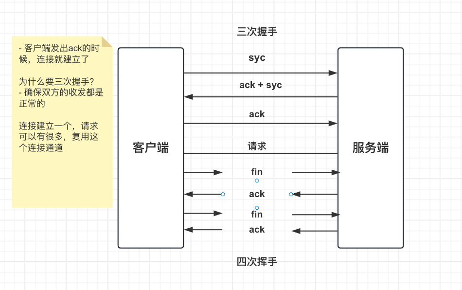

## Nginx - 核心模块

### 1. 监控nginx客户端的状态

模块名: --with-http_stub_status_module

```
location / {
    root   /usr/share/nginx/html;
    index  index.html index.htm;
}
// 添加模块配置
location = /status {
    stub_status on;	
}
```

然后打开/status的页面，可以看到

```
Active connections: 1  // 当前nginx正在处理的活动连接数
server accepts handled requests  // 服务 接收 写入 请求
1 1 4
Reading:0 Writing:1 Waiting:0
```

- accepts 总共处理的连接数
- handled 成功创建握手数
- requests 总共处理请求数
- Reading 读取到客户端的Header信息数
- Writing 返回给客户端的Header信息数
- Waiting 开启keep-alive的情况下 这个值等于 active-(reading+writing)
- 这些信息可以监控nginx当前的负载情况 也可以用比如nagios这种开源监听系统监控服务的状态

### 2. 文本替换

模块名: --with-http_sub_module

```
location / {
    root   /usr/share/nginx/html;
    index  index.html index.htm;
    stu_filter "haha" "hoho";
    stu_filter_once off; // 是否只替换一次，默认是on，off就全局替换了
}
```

### 3. 请求限制

> 在实际业务场景中，要避免恶意的大量请求，所以要做控制，比如一个ip每秒中只能访问多少次之类的

首先看一下连接的建立流程，三次握手和四次挥手:



- keep-alive nginx默认是65s连接保持（每个新的请求就重新计时

请求限制有两种 一种是控制连接数 一种是限制请求数

#### 3.1 控制并发的连接数

共享连接内存是存放限制数据的地方，比如一个master有4个worker，如果配置是一秒一个连接，那么第一个连接发送给了worker1，
就会存一份记录在共享内存中，然后这个ip又尝试对worker2进行连接，那么worker会先去共享内存中找一下，如果找到这个ip已经有连接的话，就会关闭这个新的连接请求。

连接数和worker数量没关系，数据都放在共享内存中

- --with-limit_conn_module 编译参数时的写法
- ngx_http_limit_conn_module 实际的模块名

如果指定了--with-limit_conn_module这个参数，会把ngx_http_limit_conn_module编译进入可执行文件

```
// $binary_remote_addr 内置变量 是客户端的ip地址,二进制  
// 共享内存
limit_conn_zone $binary_remote_addr zone=conn_zone:10m;
server {
    location / {
        root   /usr/share/nginx/html;
        index  index.html index.htm;
        // 并发连接数 同一个ip
        limit_conn conn_zone 1;
        // 限制的连接返回500 默认是503
        limit_conn_status 500;
        limit_conn_log_level warn;
        // 连接速率是50 意思是 每秒服务端可能向客户端发送50字节的数据 （返回的慢 方便测试？）
        limit_rate 50;
    }
}
```

#### 3.2 控制并发的请求数

- 模块名 ngx_http_limit_req_module
- 在NGX_HTTP_PREACCESS_PHASE阶段生效
- 生效算法是漏斗算法，把最突出的流量限定为每秒恒定多少请求

```
// 限制请求区域  
// zone=req_zone 区域是req_zone
// 共享内存大小10m  速率：一个ip每秒一个请求
limit_req_zone $binary_remote_addr zone=req_zone:10m rate=1r/s
server {
    location / {
        root   /usr/share/nginx/html;
        index  index.html index.htm;
        
        // 示例一：这时候 并发10个 1成功 9失败
        // limit_req zone=req_zone; 
        
        // 示例二：漏斗
        // limit_req zone=req_zone burst=3; 
    }
}
```

配置1： limit_req zone=req_zone;

这的时候，就是完全按照上面定义的1秒1个请求来处理，多余的都会失败

配置2： limit_req zone=req_zone burst=3

会生效漏斗算法，burst是迸发 激发的意思，这边设置了3等于是在漏斗里可以缓存3个请求（缓冲区），从漏斗中流出还是保持1秒一个的恒定值。
这比较符合实际场景，客户端请求的到来是不规则的，有可能一秒一个都没有，下一秒就有很多个，这样的配置可以把不稳定的事情变稳定。

打个比方现在 【ab -n 5 -c 5 http://127.0.0.1/test】  这样每秒并发5个请求，共5个（就是说共1秒）

会失败1个，1个丢进去就去处理了，3个在漏斗里，总花费3秒，0秒一个，1、2、3各一个

### 4. 访问控制

基于ip的访问控制 -http_access_module

```
location = /test2 {
    // 拒绝某个ip 这边不需要加http什么的协议名，因为配置外层就包了http，默认就是http
    deny 127.0.0.1;
    allow all;
}
```

### 额外的记录

并发十个请求测试：ab -n 10 -c 10 http://127.0.0.1/test

ab是Apache Benchmark工具，用于测试web服务器性能的

- -n 10: 指定执行的请求数量为 10。这表示会发送 10 个请求给服务器
- -c 10: 指定并发连接数为 10。这表示同时会有 10 个请求在同一时间发送给服务器

比如-n 20 -c 10的话，就是一秒并发10个，总共20个，就是说用时两秒
